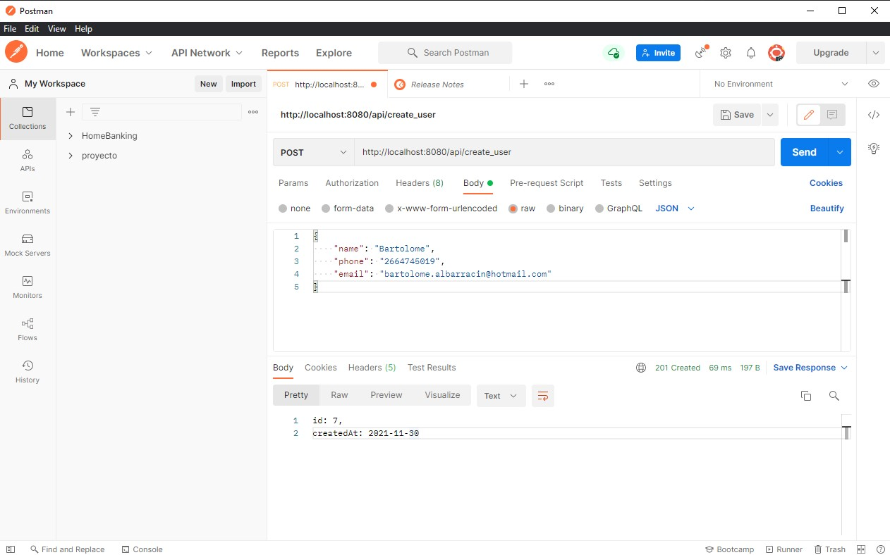
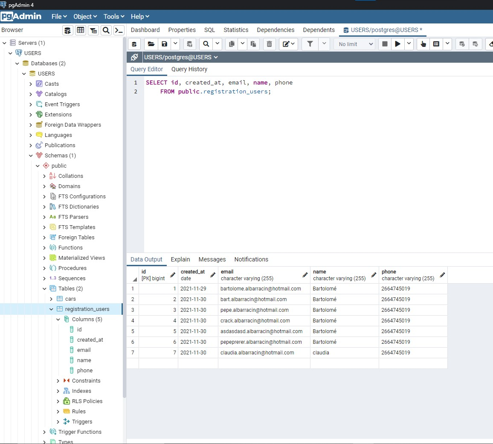
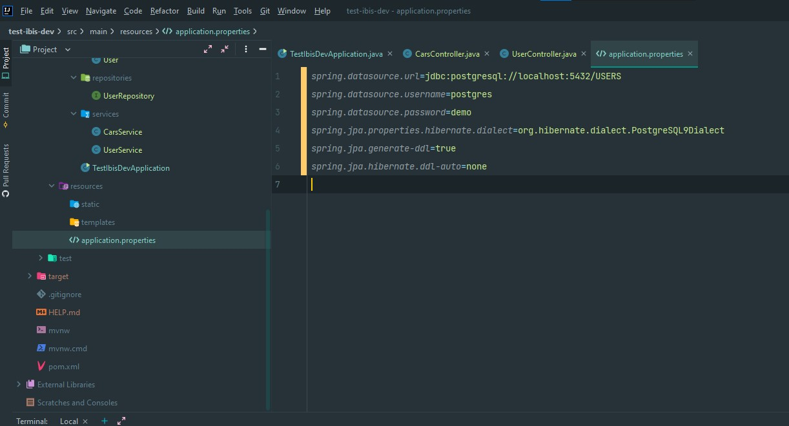

# test-ibis-dev

### Pasos necesarios para correr este back

- El proyecto se construyó sobre el IDE de Intellij
- Tener instalado maven en su sistema operativo o usar el mvn wrapper.
- Corroborar que tome todas las dependencias que tenga en el archivo POM.
- Correr el proyecto desde el boton play de la app. - o usar en terminal el codigo: mvn spring-boot:run o - bien el plugin del mvn wrapper spring-boot:run

### Información respecto a pruebas

- Para la carga de usuarios se utilizó PostMan
- Realizar POST a la dirección  http://localhost:8080/api/create_user
- Raw Json ->

{
    "name": "Bartolome",
    "phone": "2664745019",
    "email": "bartolome.albarracin@hotmail.com"
}
& Click Send

### Información respecto a la persistencia de datos

- Se utilizó la DB de Postgress PGADMIN 4 versión 14
- Hay que tener instalado el programa -> https://www.postgresql.org/download/
- Crear una DB de forma local con "localhost" llamada "USERS"
- En caso de que pida contraseña usar "demo" - o la local que se definió al instalar el programa.
- La migración de los datos se realizó con el mismo JPA, cualquier configuración que se quiera realizar se tiene que ir a la ruta: src/main/resources/application.properties

